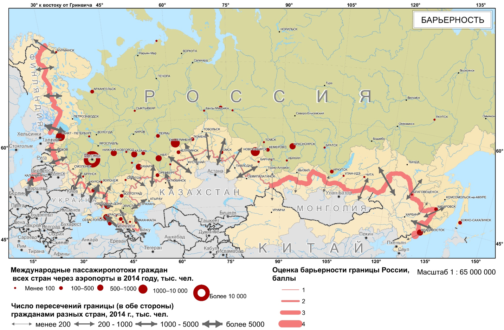
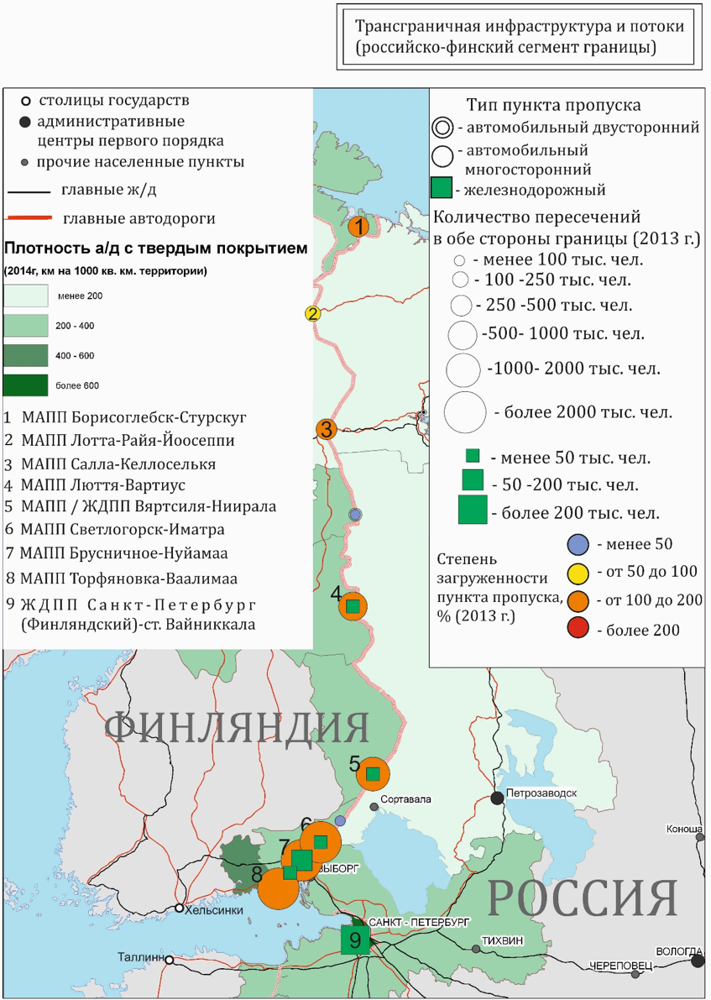
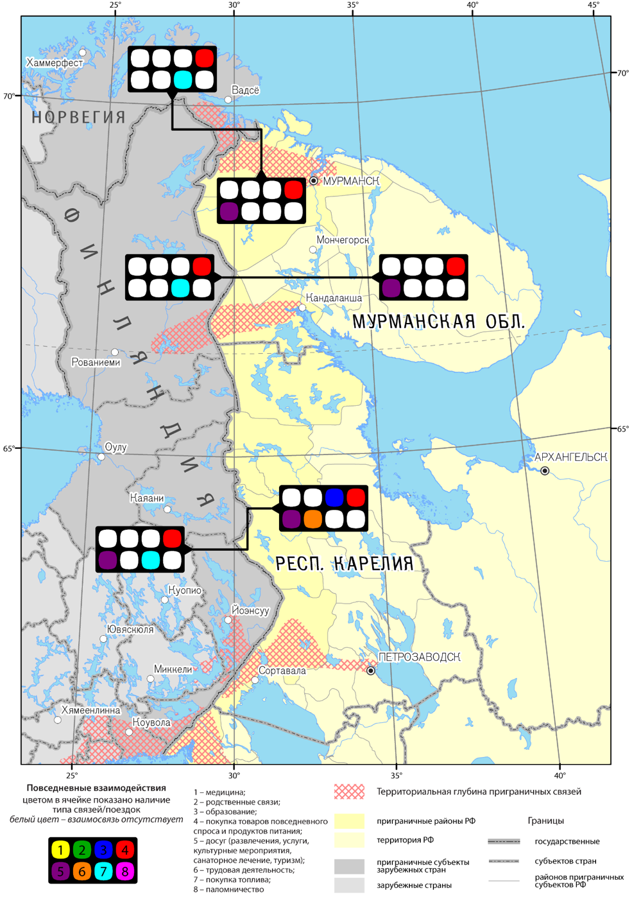
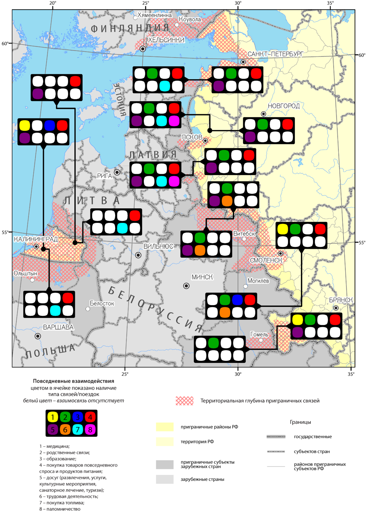
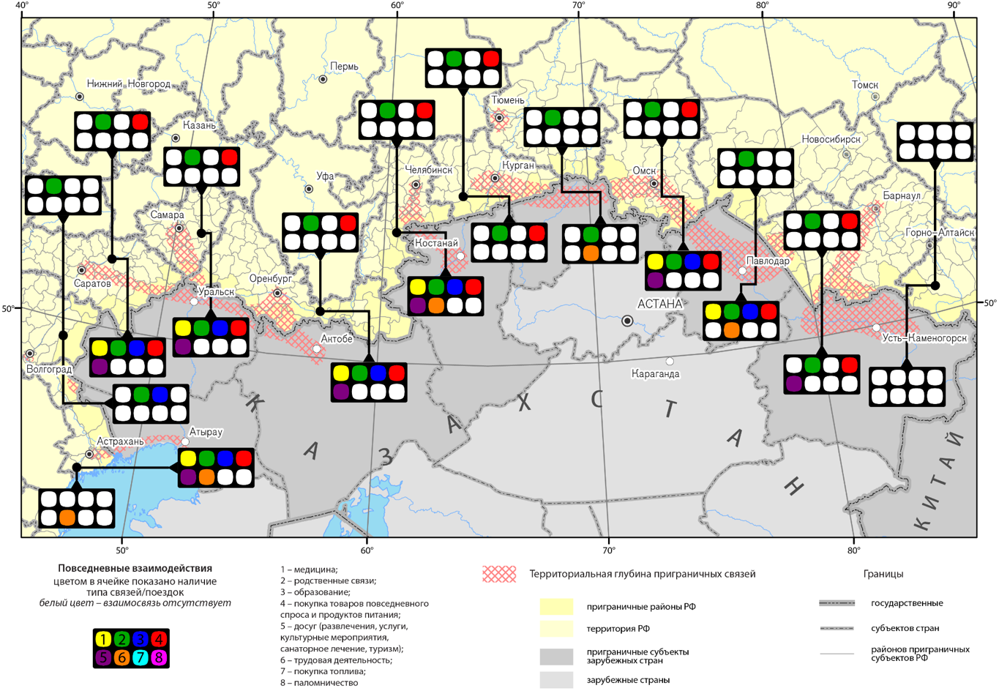

# Динамика трансграничных взаимодействий {#trans}

```{r setup, include=FALSE}
knitr::opts_chunk$set(echo = FALSE)
```

## Трансграничные потоки и барьерность государственной границы {#trans-flow}

В 2015 году на границах России функционировало 388 сухопутных, морских, речных и воздушных пунктов пропуска (ПП). Большинство из них появились еще в начале 1990-х годов и были обустроены по инициативе и при участии региональных властей, заинтересованных в упрощении трансграничных контактов и развитии внешнеэкономической деятельности. Со второй половины 2000-х годов началась оптимизация и модернизация сложившейся сети. Наиболее частым случаем было закрытие локальных ПП, но по инициативе федеральных органов и субъектов РФ, а также крупных экспортеров открывались и новые. Например, на границах с Финляндией и Польшей, где этого потребовало развитие торгово-экономических связей и рост числа пересечений границы. К 2015 году на сухопутных границах РФ оставалось 230 ПП, предназначенных для пассажирского или грузопассажирского сообщения, из которых только 158 были реально действующими. 

> Согласно ст. 12 Закона РФ от 01.04.1993 № 4730-1 “О государственной границе Российской Федерации“ пункты пропуска через государственную границу устанавливаются международными договорами РФ или Правительством РФ. Пункт пропуска открывается по завершении его строительства (реконструкции), оборудования и принятия в эксплуатацию.

Степень востребованности ПП и необходимости иметь их развитую сеть в значительной мере определяются историей и современным состоянием двусторонних отношений России и ее соседей, а также плотностью населения и общим уровнем освоенности территории. Закономерно, что наиболее плотная сеть ПП сложилась на границах России с постсоветскими государствами – 71% всех сухопутных пассажирских и грузопассажирских пунктов пропуска России. Однако и в этом случае постоянно происходят изменения. Острый кризис в российско-украинских отношениях привел к резкому сокращению ПП на этом сегменте границы. К концу 2014 года Госпогранслужбой Украины были закрыты не только все 155 местных двусторонних ПП (кроме Меловое–Чертково), но и некоторые международные. Часть их потом возобновила работу. Одновременно на участке крымской границы, которую Украина считает не государственной, а административной, установлено шесть новых ПП, из которых функционируют только три автомобильных. Государственная пограничная служба Украины не признает деятельность ПП в Донецкой и части ПП в Луганской областях – территориях, контролируемых ополченцами.

На границах России с пятью странами ЕС располагается 37 действующих ПП (23% от их общероссийского числа). На российско-монгольском и российско-китайском участках плотность ПП чрезвычайно низка вследствие слабой заселенности и освоенности территории: 15 действующих ПП на границе с Китаем и 10 – с Монголией. 

Важнейшей характеристикой ПП является их пропускная способность, которая рассчитывается с учетом потенциальных транспортных потоков и интенсивности экономического взаимодействия между странами. Однако расчетная и реальная пропускная способность далеко не всегда совпадают. В одних случаях, динамика трансграничных взаимодействий оказывается недооцененной, что приводит к концентрации людей и транспортных средств на границе, в других – наоборот. Работе ПП с полной загрузкой также мешают локальные инфраструктурные ограничения: качество дорог, отсутствие прямой связи между пограничными переходами, находящимися в относительной близости друг от друга, режим работы и статус ПП. Как показали расчеты коэффициента загруженности  по данным на 2013 год, наиболее загруженными были ПП на отдельных участках границ с Китаем, Украиной, Польшей, Финляндией и Азербайджаном, а недогруженными – на границах с Латвией и Монголией, а также ряд ПП на границе с Украиной и Финляндией. Как правило такие ПП были расположены на второстепенных автодорогах с низким качеством покрытия или имели неудобный график работы.

> __Коэффициент загруженности__ – соотношение реального потока автотранспортных средств и людей через пункт пропуска и его проектной пропускной способности.

> ГРАФИК: Динамика пересечений границы России физическими лицами через сухопутные и смешанные пункты пропуска в 2010–2016 гг., млн. пересечений

### Барьерность границ {#trans-flow-barriers}

Ключевой проблемой развития трансграничных взаимодействий является противоречие между интенсификацией трансграничных потоков под влиянием процессов глобализации и региональной интеграции и сохраняющейся, а иногда и усиливающейся барьерностью границ. Факторами, усугубляющими это противоречие, являются сложные отношения между странами, поиски национального самоопределения и идентичности. Реальные физические, социально-экономические и транспортные барьеры оказываются значительно ниже, чем идеологические и ментальные. 

Другая причина противоречия между контактностью и барьерностью границ лежит в сфере ее инфраструктурного обустройства. Эффект «перегруженности» пункта пропуска возникает как на наиболее востребованных участках границы, где растущая интенсивность трансграничных потоков опережает развитие сети ПП, так и в противоположной ситуации. Длинные очереди увеличивают барьерность государственной границы и на наиболее инфраструктурно-обустроенных участках границы с Польшей и Финляндией, и на границах с Китаем и Азербайджаном, где редкая сеть пунктов пропуска не справляется с довольно скромными трансграничными потоками.

__Барьерность__ --- это динамичная категория, которая зависит от процессов перераспределения контактных и барьерных функций между границами разных иерархических уровней, а также внешней и внутренней политики. Важно отметить, что барьеры для перемещения граждан в другую страну не обязательно связаны с внешними границами: важнейшими пропускными пунктами стран уже давно стали столичные аэропорты. Миграционный контроль осуществляется на всей территории государств. Консульства и специализированные организации, располагаются во многих крупных городах, они внимательно анализируют анкеты лиц, подающих заявки на визу, фильтруя потенциальных трудовых мигрантов или отбирая из их числа тех, кто подходит по квалификации, возрасту и иным характеристикам.

Барьерность трудно поддается параметризации. Индикаторы барьерности можно подразделить на общие, применимые ко всем видам потоков (пропускная способность коммуникаций, ведущих к границе, и пунктов пропуска, их плотность в расчете на 100 км границы, быстрота и качество работы таможенных и пограничных служб), и частные, воздействующие на некоторые из них (визовый режим).

Барьерность по-разному проявляется в случае разных потоков – миграционных, товарных, финансовых, информационных. Она часто носит асимметричный характер. Так, падение курса рубля снизило экономические барьеры на российских границах для граждан большинства соседних стран ЕС и повысило для россиян. Для посещения Украины российским гражданам требуется заграничный паспорт и приглашение, в то время как украинские граждане могут посещать Россию по внутреннему паспорту. В течение многих лет украинские граждане могли ездить в страны ЕС только по визе, тогда как Украина отменила визовой режим для европейцев. В экономической сфере нетарифные барьеры для одних и тех же групп товаров (экспортные и импортные пошлины, меры фитосанитарного контроля) могут сильно различаться при пересечении одной и той же пары границ в разных направлениях. Даже в рамках единой таможенной территории ЕАЭС для его внутренних границ сохраняется асимметрия. Так, экспорт товаров из России в Белоруссию в результате действия нетарифных барьеров приводит к их удорожанию в среднем на 25%, а из Белоруссии в Россию – только на 10%.

Степень барьерности границы зависит от вида использования транспорта и места жительства человека. В России она существенно ниже для жителей столиц и городов, где расположены иностранные консульства и крупнейшие международные аэропорты, а также жителей отдельных приграничных регионов (Калининградская, Псковская, Мурманская области), где действует режим малого приграничного передвижения (МПП) с соседними странами.

```{r barriers, fig.cap="Барьерность"}

```

На карте «Барьерность» приведена оценка степени барьерности российских границ для среднестатического гражданина РФ. Она показывает значительные различия в людских потоках, пересекающих разные участки границ, и роль международных аэропортов, особенно Московского авиационного узла как главных «миграционных ворот» страны. Для определения степени барьерности границы для перемещений людей учитывались такие факторы как режим границы, сложности оформления визы и ее стоимость, процент отказов, сроки действия выдаваемой визы, и пр. Затем каждому фактору присуждался свой «вес» в зависимости от создаваемых им трудностей для свободного перемещения людей. Эти значения были определены экспертным путем: наибольший факторный вес был придан визовому режиму границы. В результате для разных сегментов границы были рассчитаны суммарные баллы, характеризующие степень ее барьерности. 

В 2005–2015 гг. барьерные функции многих участков российских границ усилились. Это стало результатом многих внешнеполитических событий: расширения границ ЕС и шенгенской зоны, вооруженных конфликтов (Южная Осетия, 2008; Украина, 2014–2015), введения экономических санкций Запада и ответных мер России, ослабление курса рубля, изменения порядка функционирования транспорта и пересечения границ, свертывание программ приграничного сотрудничества, и пр. Наибольшие изменения коснулись российско-украинского и российско-грузинского сегментов российской границ, наименьшие – российско-белорусской и российско-казахстанской, хотя и там заметно усиление контроля и повышение требований к обеспечению безопасности. Барьерные функции границ России со странами ЕС выросли незначительно, несмотря на глубокий политический кризис и взаимные санкции. Недружественная риторика на уровне государств и политических лидеров не привела к разрыву добрососедских отношений между муниципальными образованиями соседних стран. Приграничное сотрудничество пока не затронуто санкциями ЕС, сохранены режим МПП и программы Европейского инструмента соседства (ENI). 

### Типология российского пограничья по показателям контактности/барьерности {#trans-flow-types}

В основу типологии участков российского пограничья, помимо балльной оценки «барьерности», были положены показатели интенсивности пересечения границы, характер и динамика трансграничных потоков. Были выделены следующие типы.

1. Мало контактные границы, для которых характерно малое число пересечений российскими гражданами, низкая интенсивность потоков и отсутствие заметной динамики на фоне высоких значений индикатора барьерности границы и слабых связях местного населения. Этот тип характерен для корейского, монгольского и норвежского сегментов российской границы.

    > ГРАФИК: Динамика числа пересечений физ. лицами через сухопутные и смешанные пункты пропуска мало контактных границ, 2010–2016 гг., тыс. пересечений

2. Границы «сдерживающие» развитие контактов населения. Для данного типа характерно сочетание заинтересованности населения в контактах, в силу наличия родственных и дружеских связей, при отсутствии динамики их развития, невысоком числе пересечений границы и средне-высоких показателях барьерности. Такая ситуация характерна для сегментов границы с Латвией, Литвой, Грузией и Азербайджаном.

    > ГРАФИК: Динамика числа пересечений физ. лицами через сухопутные и смешанные пункты пропуска на границах, сдерживающих развитие «контактов», за 2010–2016 гг., тыс. пересечений

3. Границы «способствующие» развитию контактов населения. В этом случае, несмотря на выраженную барьерность границ, наблюдается интенсивный трансграничный обмен населением и положительная динамика трансграничных потоков. Данный тип характеризует границы с Финляндией, Польшей, Эстонией и Китаем. Наряду с другими факторами, свою роль в этом случае играет упрощенный режим пересечения границы, прежде всего, для жителей приграничных регионов.

    > ГРАФИК: Динамика числа пересечений физ. лицами через сухопутные и смешанные пункты пропуска на границах, «способствующие» развитию контактов населения, за 2010–2016 гг., тыс. пересечений 

4. Открытые контактные границы, существующие между странами-членами Евразийского экономического союза – Белоруссией и Казахстаном. Здесь относительная стабильность числа перемещений граждан сочетается с низкой барьерностью. Наблюдаемые здесь позитивные сдвиги определяются не только прагматическими задачами экономического развития, но и субъективными факторами национального, регионального и локального уровней.

5. Мутирующие границы, характер функционирования которых сильнейшим образом зависит от геополитических обстоятельств. В этот тип попадает сегмент российско-украинской границы. Еще недавно высокая интенсивность трансграничных взаимодействий граждан сменилась здесь их резким спадом и ростом барьерности. Под влиянием кризиса в двусторонних отношениях число пересечений границы через автомобильные и железнодорожные пункты пропуска снизилось почти вдвое. В то же время на многих переходах в Ростовской области число пересечений границы в 2014 г. выросло за счет беженцев из зоны конфликта.

    > ГРАФИК: Динамика числа пересечений границы России и Украины (мутирующие границы) физ. лицами через сухопутные и смешанные пункты пропуска в 2010–2014 гг., тыс. пересечений

Существуют и другие типологии, использующие критерии контактности/барьерности границ. Например, Л.Г. Осмоловская предложила типологию, акцентирующую внимание на открытости границ для взаимодействий. Она выделила: 1) открытые (безбарьерные) участки российского пограничья, к которым отнесла сегмент российско-белорусской границы; 2) взаимозависимые (кооперационные) участки на границе с Казахстаном; 3) активно взаимодействующие – граница с ЕС и граница с Китаем; 4) локально взаимодействующие – граница с Украиной, странами Южного Кавказа, частично с Китаем и Монголией; и 5) изолированные (отчужденные) – тип регионов, изолированность которых определяется природными условиями, высокогорьем, отсутствием инфраструктуры и экономических контрагентов.

> ГРАФИК: Динамика числа пересечений границы России и Китая физ. лицами через сухопутные и смешанные пункты пропуска в 2010–2016 гг., тыс. пересечений

Типология российского пограничья по показателям контактности/барьерности показала, что, во-первых, относительной открытости границы и политики добрососедства еще недостаточно для активизации трансграничных контактов, необходимо инфраструктурное обеспечение. Во-вторых, локальные агенты трансграничных взаимодействий далеко не всегда следуют в курсе политики «центральных властей». Стремление «закрыть» границу, кризисные явления и острые конфликты на межгосударственном уровне не приводят к тотальному свертыванию трансграничных взаимодействий на локальном: накопленный в предыдущие годы позитивный опыт поддерживает стремление к контактам и совместной деятельности.

```{r fintrans, fig.cap="Трансграничная инфраструктура и потоки (российско-финский сегмент границы"}

```

> КАРТА: Приграничное сотрудничество (малая интеграция)

## Повседневная жизнь вблизи российской границы {#trans-life}

Появление новых и открытие старых границ в конце 1980-х – начале 1990-х гг. в купе с резким падением уровня жизни среди подавляющего большинства граждан России и стран СНГ привело к существенной трансформации жизни приграничных сообществ, вынужденных адаптироваться к изменившимся обстоятельствам. В результате на каждом участке границы сложился свой набор социальных и экономических практик, связанных в первую очередь с удовлетворением личных потребностей, которые постепенно вошли в повседневную жизнь местных сообществ. Движущей силой подобных приграничных взаимодействий первоначально выступал прагматизм, позволяющий людям выиграть на разнице в ценах на товары и услуги по разные стороны границы. Затем рентно-спекулятивная модель отношений с соседями, типичная для российского пограничья в первое постсоветское десятилетие, сменилась более дифференцированными взаимодействиями, связанными с развитием малого бизнеса, услуг, туризма.

Экспертным методом выделено восемь основных типов взаимодействий, которые вошли в повседневную жизнь местных сообществ, а именно: трудовая деятельность, образование, медицина, родственные связи, покупка товаров повседневного спроса и продуктов питания, покупка топлива, досуг (развлечения, услуги, культурные мероприятия, санаторное лечение, туризм), паломничество. Изучена территориальная глубина приграничных связей, экспертным методом выделена зона тесных взаимодействий по обе стороны границы, сопоставленная с расположением значимых населенных пунктов и инфраструктурной сетью, играющими системообразующую роль в приграничном пространстве.

На каждом участке границы выделены наборы социальных и экономических практик, связанных с удовлетворением личных потребностей, которые постепенно вошли в повседневную жизнь местных сообществ и существенно повлияли на экономику приграничных районов. Среди таких повседневных взаимодействий выделяется не только покупка товаров, поездки к родственникам, событийный, познавательный и развлекательный туризм, но и поездки за медицинскими (в белорусские и китайские приграничные регионы) и образовательными услугами (из Карелии в Финляндию, из Казахстана в Новосибирск или Омск), на работу, а также паломничество. На разных участках пограничья сложились гибкие, динамичные и асимметричные теневые трансграничные рынки, возникли свои ходовые товары или услуги, а также легенды вокруг них. 

```{r dailyfin, fig.cap="Повседневные взаимодействия (российско-финский сегмент границы"}

```

```{r dailybel, fig.cap="Повседневные взаимодействия (российско-прибалтийский сегмент границы"}

```

```{r dailykaz, fig.cap="Повседневные взаимодействия (российско-казахстанский сегмент границы"}

```

На отдельных участках границы (Харьков-Белгород) распространены и трудовые миграции, хотя говорить о формировании трансграничного рынка труда на российском пограничье пока рано.  Сама граница стала важным местом приложения труда. На многих участках границы (с Украиной, Китаем, Финляндией, Польшей) широко развился рынок частных транспортных услуг, востребованы услуги гидов (т.н. «помогайки» на китайской границе) и переводчиков, налажен бизнес по изготовлению и доставке в РФ нотариально заверенных приглашений, необходимых для пересечения украинской границы. 

Выдвигаемые локальными контекстами трансграничные практики со временем стали в российском пограничье повсеместно распространенными. Они заняли заметное место в повседневными жизни местного населения и продолжают его сохранять несмотря на постепенный процесс их обновления и видоизменения. 

Исследование выявило определенную чувствительность приграничных взаимодействий к внешнеполитической и экономической конъюнктуре. Геополитические обстоятельства, падение цен на нефть и курса рубля приводят к значительным сдвигам в направлениях (в Россию или из России), и структуре трансграничных потоков. Изменение обменных курсов ограничило мобильность россиян, но привело к резкому скачку числа шопинг-туристов из соседних стран с конца 2014 г. В то же время сокращение потока россиян за товарами и услугами после обвала рубля заставляет власти соседних регионов (Китая, Польши, Финляндии) искать альтернативы торговым и курортно-лечебным связям, активизировать развитие совместного бизнеса и экономического сотрудничества, вырабатывая надежный аппарат связей и создавая более благоприятную среду для двухсторонних контактов на уровне политических решений.

Такие приграничные взаимодействия не прошли бесследно для местного населения, которое приобрело ценный опыт трансграничных взаимодействий, правила поведения и действий в иной социальной среде. Прагматизм, активизируя приграничное взаимодействия, позволяет выигрывать и территориям, и людям, поддерживающих взаимовыгодных и добрососедских отношения. В результате создается ткань взаимодействий, меняется отношение к жителям приграничья, «образ врага» трансформируется в образ «хорошего соседа».

Интенсивные трансграничные взаимодействия, новые ценности и образ жизни могут стать источником новой трансграничной идентичности. Открытие границ создает единое информационное и социокультурное пространство, повышает интерес и доверие друг к другу, вызывает чувство трансграничного жителя, которому комфортно по обе стороны границы. Это становится стилем и образом жизни. Прямые контакты позволяют противостоять взаимным стереотипам и сопоставить предрассудки и предубеждения с действительностью. Непосредственные контакты и близкие соседские взаимоотношения дают шанс «сократить» общественную дистанцию.

Повседневная жизнь формируется таким образом, что жители трудно существовать без соседа. Потребление за границей становится привычкой, от которой сложно отказаться. Среди российского населения давно укрепилось доверие к качеству западной продукции, престижность отдыха на западе, трепет перед западными ценностями. Поэтому несмотря на санкции, обвал рубля и напряженную обстановку поездки в соседние регионы полностью не прекращаются.