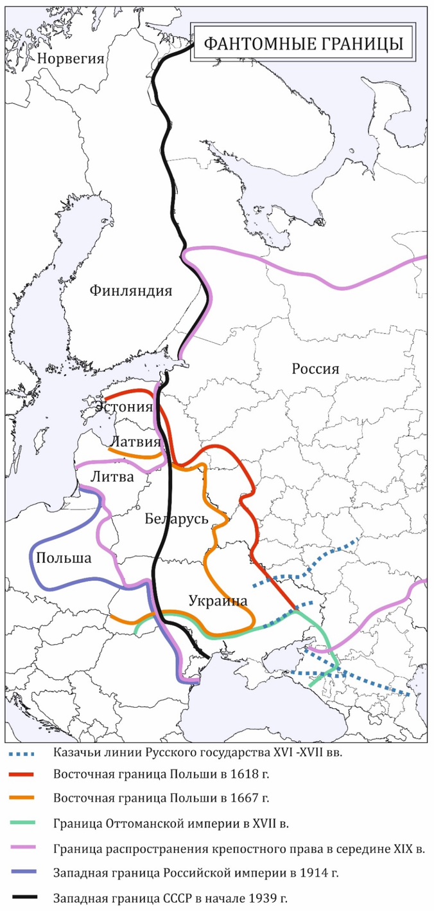
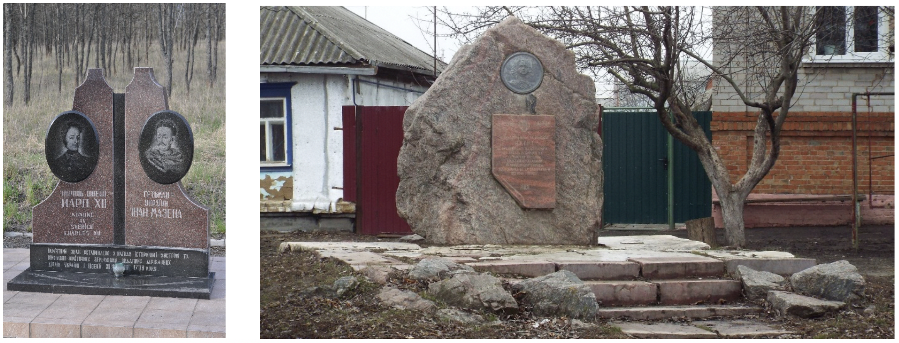
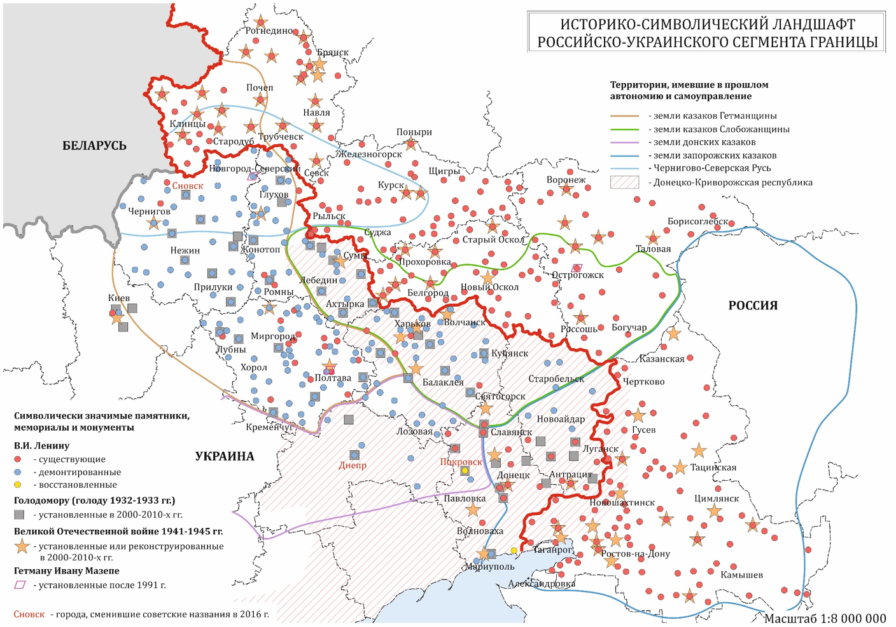
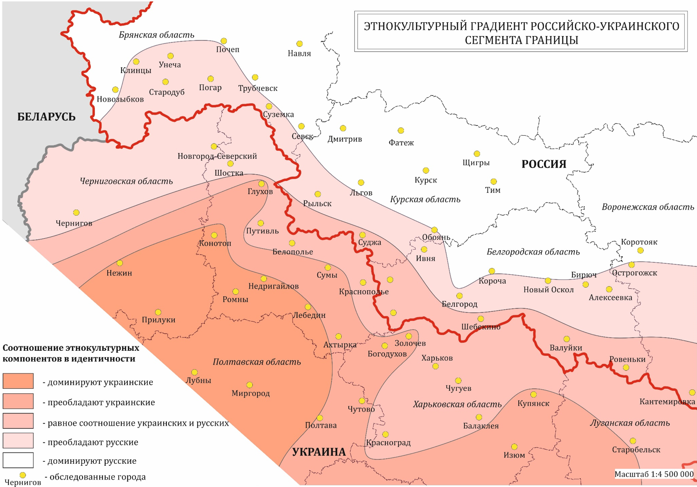

# Соотношение культурных, ментальных и институциональных границ {#borders}

```{r setup, include=FALSE}
knitr::opts_chunk$set(echo = FALSE, fig.align = 'center')
```

## Историко-культурный и символический ландшафт {#borders-landscape}

Границы – сложная социальная категория, результат процесса воспроизводства разграничений разными социальными и политическими субъектами в ходе их деятельности (bordering). Их установление в общем виде стремиться удовлетворить три базовых потребности общества: а) формирование консолидирующей общество идентичности (национальной идентичности); б) делимитация и легитимация политической, социальной или культурной группой контроля над определенной территорией; в) обеспечение безопасности – защиты от внешних и внутренних угроз. Эта особенность границ делает их высоко символичными объектами вне зависимости от того, были и являются ли они реальными (политические и исторические границы) или имеют субъективный и аскриптивный характер (культурные, ментальные и этнические границы), поскольку они почти всегда пространственно взаимосвязаны. Однажды начерченные и институционально оформленные границы со временем оставляют глубокий след в культурном и социальном ландшафте (фантомные границы), и, наоборот. Например, политические границы нередко появляются там, где формируются незримые, нормативно закрепленные в обществе границы.

```{r phantom, fig.cap="Фантомные границы"}

```

Современные границы России несут в себе память о границах Киевской Руси (Изборск, Псков), Хазарского каганата (Дивногорье, Воронежская область), Золотой Орды, Великого княжества Литовского (Белгородская, Курская, Смоленская области). Границы России с Норвегией, Финляндией, Эстонией и Латвией в значительной мере вернулись к рубежам, установленным еще в XVII веке между Россией, Швецией и ее протекторатами. На южных и восточных границах России отчетливо выявляются следы былого соседства с Крымским ханством, Ираном, Хивинским ханством и Цинской империей Китая. Бывшие фортификационные границы, ставшие фронтирами после потери ими своих оборонительных функций, рельефно выражены в современной системе расселения и культурном ландшафте. Белгородская и Сибирская линии XVII-XVIII вв. служили опорой экспансии российского государства и повлияли на делимитацию будущих государственных границ. За Белгородской чертой сформировался уникальный регион Слободская Украина со специфической русско-украинской идентичностью населения, разделенный сначала административными, а затем государственными границами между Россией и Украиной. Сибирская линия, ныне разделенная границами России и Казахстана, продолжает служить сегодня каркасом расселения и осью экономического развития приграничных регионов.

Политические агенты часто используют границы в качестве инструментов государственного строительства и управления общественным сознанием, в том числе путем оспаривания и перекодирования исторического и культурного наследия и памяти. В арсенале национальных государств имеются значительные средства, способные направить процесс социализации своих граждан в определенное русло, среди которых средства массовой информации, система образования, исторические нарративы, символический ландшафт и места памяти («lieux de mémoire» по П. Нора).
Особенности репрезентации культурного наследия в пограничье во многом зависят от господствующих в стране исторических нарративов. Практически по всему периметру российских границ происходят процессы, связанные с формированием и «восстановлением» исторической памяти путем нарративизации. Яркий пример – музей Полтавской битвы: после провозглашения независимости Украины его главным героем стал гетман И. Мазепа, а победитель Полтавской битвы – Петр Великий – негативным персонажем.  Сменилось и отношение к Карлу XII, на сторону которого перешел И. Мазепа. Если в начале 1990-х годов это проявлялось только в характере экскурсий, то в последующем была изменена и экспозиция музея.

```{r mazepa, fig.cap="Монументы, посвященные историческим встречи И. Мазепы с Карлом XII вблизи Новгород-Северского Черниговской области Украины (слева) и с Петром I в Острогожске Воронежской области России (справа)"}

```

Еще недавно малозаметная в культурном и политическом отношении граница с Украиной сегодня выглядит уже как исторический рубеж (фронтир) двух государств. На украинской стороне практически полностью снесены памятники Ленину (ключевой маркер советского пространства), на смену которым пришли монументы и мемориалы в память о Голодоморе, плотность которых особенно высока в приграничье. С российской стороны границы памятники Ленину не только сохранились, но и были обновлены. Заметно выросло число музеев, посвященных событиям Великой Отечественной войны, а также новых памятников ее героям. Различия в прочтении истории по разные стороны границы при сохранении тесных контактов населения приводят к углублению разрыва между национальными историческими нарративами «своих» стран и местной исторической памятью, росту противоречивости локальных идентичностей.

Для российского пограничья характерна конкуренция идей «культурной отличительности» и «культурного единства». Центральное место в символическом ландшафте приграничных районов соседних стран занимают следующие ключевые темы: 1) переоценка истории Второй мировой и Великой Отечественной войны; 2) длительность истории «новой» государственности и размежевание с Россией; 3) конфессиональные различия с Россией как основа этнокультурной и национально-государственной идентичности.

```{r ukrsym, fig.cap="Историко-символический ландшафт российско-украинского сегмента границы"}

```

Переоценка истории Второй мировой и Великой Отечественной войны в наибольшей степени затронула страны Балтии, Польшу и Украину.  За последние годы здесь были снесены многие памятники советским воинам, коренным образом изменилось отношение к созданным в советское время музеям и монументам. Пересмотр итогов войны и особенно придание статуса национальных героев деятелям, выступавшим на стороне нацистов, стали одной из причин раскола украинского общества. С российской стороны границы также проводилась работа по изменению экспозиций музеев, но она касалась вынесения в публичную сферу ранее замалчиваемых фактов военных и гражданских потерь, ошибок советского руководства, репрессий и пр. Как правило, экспозиции российских музеев охватывают территории не только своего региона, но частично и соседних стран, рассказывая, например, об участии в войне русских, украинцев и белорусов. Наиболее яркий пример – Климовский музей дружбы народов. Для белорусского пограничья также характерны процессы детализации исторической памяти о войне как опоры национально-государственной идентичности. Для казахстанского пограничья, в отличие от украинского, характерно уважительное отношение к воинской памяти и подчеркивание участия Казахстана в «европейской» войне.

```{r hazun, fig.cap="Новый мемориальный комплекс Хацунь (Брянская область России)"}
knitr::include_graphics('img/08_Hazun.png')
```

Обоснование длительности истории «новой» государственности и исторического размежевания через монументальную пропаганду затронуло все постсоветские страны. Вблизи границы встали памятники таким знаковым для российской истории фигурам как Святой Владимир (Белгород), Александр Невский (вблизи Пскова и эстонской границы), императрица Елизавета (Калининград), генерал-губернатору Восточной Сибири Н.Н. Муравьев-Амурский (Хабаровск и Благовещенск) и другие.  Им на встречу с другой стороны границы поднялись монументы историческим противникам московских правителей – И. Мазепе (Украина), князьям Великого княжества Литовского – Ольгерду, Миндовгу и Витовту (Белоруссия, Литва). В Казахстане к празднованию 550-летия Казахского ханства установлен ряд памятников «основателям государства» – ханам Жанибеку и Керею, а во всех краеведческих музеях приграничных с Россией регионов были сменены экспозиции с преимущественно «русских» по содержанию на преимущественно «казахские». В этих регионах периодически происходят сенсационные археологические открытия, отодвигающие возраст создания казахстанских приграничных городов на несколько веков в историю, как например, городище Жайык, расположенное южнее Уральска. Музеи представляют великолепные макеты таких поселений.

Недружественная оценка российских действий на Дальнем Востоке характерна для некоторых китайских приграничных музеев; антироссийский дискурс адресован самим китайцам, поэтому в приграничье встречаются и такие экзотические случаи, как музеи, закрытые для посещения российскими туристами (Айгун). Контртенденцией историческому размежеванию служит сохранение памятников и музеев, свидетельствующих об историческом единстве огромного пространства. В Сибири сохранилась сеть музеев, экспозиции которых посвящена первым переселенцам, в том числе украинцам, немцам, эстонцам и латышам, столыпинским реформам, освоению целины и др. Музеи переселенцев есть и в других городах и селах, расположенных на границе с Казахстаном и Китаем.
Акцентирование конфессиональных различий с соседней страной стало не только этнокультурным, но и территориальным маркером. За последнюю четверть века в приграничных регионах построено множество культовых объектов. Наиболее знаковыми событиями были строительство православного собора и восстановление кафедрального лютеранского собора в Калининграде, крупных мечетей во всех приграничных с Россией городах Казахстана, особенно там, где преобладало русское население. Маркер новой государственной принадлежности китайской части острова Большой Уссурийский - огромная Восточная пагода, визави которой может стать проектируемый величественный православный храм.

Однако несмотря на попытки национальных правительств соседних государств унифицировано перекодировать идентичность и историческую память своих граждан, они по-прежнему дифференцировано представлены с учетом местной и региональной специфики, этнокультурного контекста и исторического развития территории. Так, в российско-украинском пограничье довольно сильно выражена этнокультурная интерференция, проявляющаяся не только в лингвистических отличиях, но и в восприятии соседей, границы с ними, исторических событий и др. 
В России позитивное, чувственное отношение к Украине (в разных аспектах) большее распространение имеет в пределах широкой полосы Слободской Украины и Гетманщины. На территориях, непосредственно прилегающих к российско-украинской границе, наблюдается "всплеск" общероссийской идентичности, несколько ослабляющий эту связь с Украиной. Во внешнем по отношению к государственной границе поясе восприятие Украины менее чувственное, более рациональное, что связано со значительной (по сравнению с внутренним поясом) культурной дистанцией от Украины.

```{r ukrethno, fig.cap="Этнокультурный градиент российско-украинского сегмента границы"}

```

На территории Украины отношение к России зависит от множества факторов, включая различные конъюнктурные. Встречается отношение к России как к "сестре", как к дружественному – но иногда и как к недружественному – соседу, оказывающему давление на Украину в целом и на приграничные регионы. В Левобережной Украине более позитивное, нейтральное отношение к России нередко прослеживается во внутренних, по отношению к российско-украинской границе, районах. Для этих территорий характерна высокая ориентация на украинский литературный (не обязательно разговорный) язык и украинскую автокефальную церковь (пример – Полтава). В то же время на периферийных территориях Левобережной Украины (характерный пример – Сумы) образ России пестрит разнообразием, часто встречаются негативные ассоциации. 