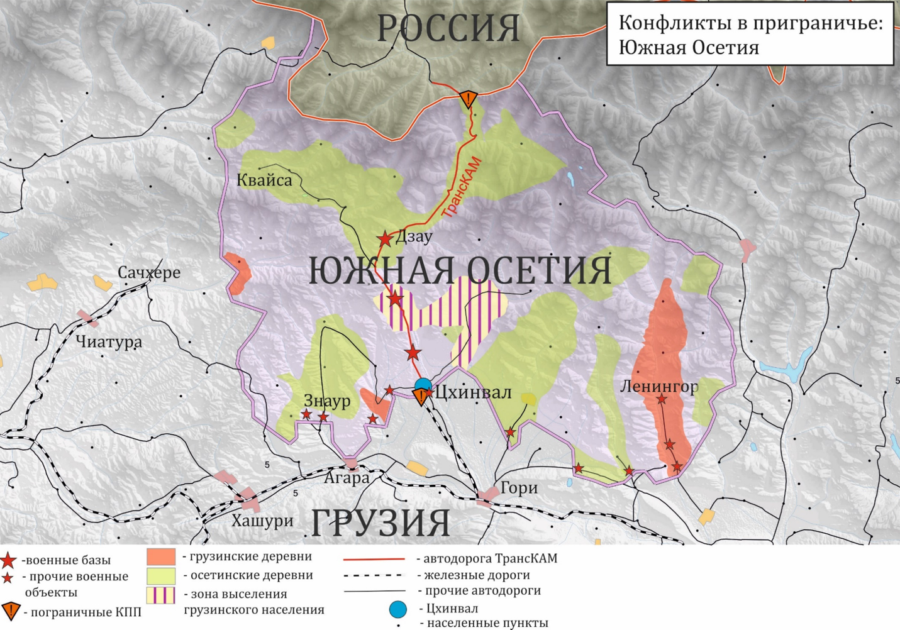

# Конфликты {#conflicts}

## Частично признанные государства вблизи российских границ {#conflicts-partial}

Соседство с Россией остается жизненно важным условием функционирования частично признанного государства республики Южная Осетия (РЮО). РФ гарантирует его безопасность, обеспечивает внешние связи и гуманитарную помощь, восстановление хозяйства и инфраструктуры. Более 90% госбюджета РЮО формируется за счет российской помощи (2015). При участии российских пограничников завершена демаркация и обустройство границы с Грузией. Большинство жителей республики, по-прежнему, категорически не приемлет компромиссов с Грузией. Единодушное желание жителей Южной Осетии воссоединиться с Республикой Северная Осетия таит значительные политические риски. Среди них: создание прецедента для других разделенных народов (например, лезгин или черкесов), возможное обострение латентного осетино-ингушского конфликта с возрождением идеи вайнахского единства. К тому же для объединения двух частей Осетии нет признанных международным сообществом процедур.  Реализация этой идеи неизбежно повлечет за собой обострение отношений России с Западом и такими важными региональными державами, как Иран и Азербайджан, положит конец наметившейся «разрядке» с Грузией. Не исключены и внутренние конфликты. Южная Осетия приобрела опыт политической самоорганизации, что может привести к противоречиям между осетинскими элитами – «городскими северянами» и «сельскими южанами». Российским ответом на ясно выраженное желание граждан и политической элиты РЮО воссоединиться с северными собратьями, особенно после присоединения Крыма, стало упразднение таможенных постов между Россией (Северной Осетией) и включение РЮО в единое с Россией экономическое пространство. В 2014 г. был подписан Договор о союзничестве и стратегическом партнерстве. Возможно, в будущем Южной Осетии будет предоставлен статус «свободно присоединившегося государства».

(\#fig:osetia)Конфликты в приграничье: Южная Осетия

Для Абхазии граница с РФ также играет определяющую роль, поскольку граница с Грузией остается фактически закрытой (исключая перемещение грузинского населения приграничных территорий через установленные пункты пропуска). Доходная часть бюджета более чем на 70% состоит из российской помощи (2015). Не вызывает разногласий необходимость российского военного присутствия в республике, гарантирующего безопасность. Однако в отличие от РЮО, опросы последних пяти лет показывают, что большинство граждан Абхазии, независимо от национальности, хотело бы ее видеть союзным России независимым государством. Отношение политических кругов Абхазии к более тесной интеграции с РФ неоднозначно. Высказываются опасения зависимости от РФ, ее возможного вмешательства во внутренние дела Абхазии, вплоть до «потери суверенитета». Приоритетом для руководства РА является информирование международного сообщества о проблемах республики, «продвижение» ее на мировой арене, расширение международного признания страны. География заявлений МИД Абхазии, в отличие от заявлений МИД РЮО, более обширна – комментарии и ноты адресуются правительствам разных государств мира, вне зависимости от признания ими РА. Как и в РЮО, общественное мнение Абхазии одобряет политику России. Возможности нормализации отношений с Грузией в обозримой перспективе не просматривается. Граждане Абхазии, как и раньше, не допускают возвращения грузинских беженцев. Они негативно оценивает роль США и ЕС на международной арене.

(\#fig:abkhazia)Конфликты в приграничье: Абхазия

Выгода соседства с Южной Осетией и Абхазией для приграничных регионов РФ – Краснодарского края и Северной Осетии – состоит в том, что в них оседает за счет государственных закупок и подрядов значительная часть масштабной российской помощи. Краснодарский край превратился в своего рода «патрона» Абхазии. Между администрацией края и правительством Абхазии подписано соглашение о разностороннем сотрудничестве. Для Абхазии соседство с емким рынком курортного Сочи и всего края тоже весьма благоприятно.
