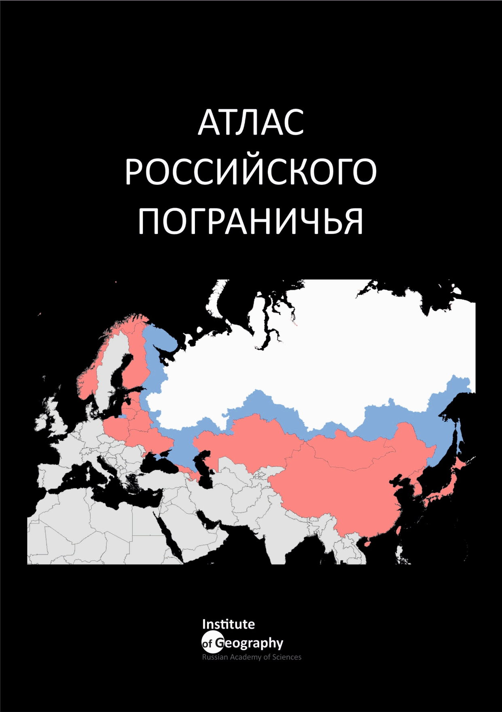

--- 
title: "Атлас Российского пограничья"
author: "Лаборатория геополитических исследований ИГ РАН"
# date: "`r Sys.Date()`"
site: bookdown::bookdown_site
output: bookdown::gitbook
documentclass: book
bibliography: [articles.bib, packages.bib]
biblio-style: apalike
link-citations: yes
github-repo: tsamsonov/borderlands
description: "Атлас охватывает широкий круг проблем в сфере внешних связей, экономики, социальной и этнокультурной ситуации, охраны окружающей среды в приграничных регионах России и сопредельных стран"
header-includes:
   - \usepackage[T2A]{fontenc}
   - \usepackage[utf8]{inputenc}
   - \usepackage[russian]{babel}
mainfont: Open Sans
---

```{r setup, echo=FALSE}
knitr::opts_chunk$set(echo = FALSE, message = FALSE, warning = FALSE, fig.align = 'center')
knitr::opts_chunk$set(widgetframe_widgets_dir = 'widgets') 

library(leaflet)
library(classInt)
library(plotly)
library(dplyr)
library(tmap)
library(DT)
library(sf)
library(widgetframe)

source('R/map.R')
source('R/plot.R')

con = DBI::dbConnect(RSQLite::SQLite(),
                 dbname = "data/borderlands.db"
)

values = DBI::dbReadTable(con, 'VALUES') %>% bind_rows(DBI::dbReadTable(con, 'DERIVATIVES'))
indexes = DBI::dbReadTable(con, 'INDEXES')

regions = st_read('data/regions.gpkg',
                  'regions',
                  stringsAsFactors = FALSE)

coords = st_centroid(regions) %>% st_coordinates()

regions = regions %>% mutate(lon = coords[,1],
                             lat = coords[,2])

cities = st_read('data/regions.gpkg',
               'cities',
                stringsAsFactors = FALSE) %>% 
  filter(border == 1 & FEATURECLA == 'Admin-1 capital')

capitals = st_read('data/regions.gpkg',
               'cities',
                stringsAsFactors = FALSE) %>% 
  filter(border == 1 & FEATURECLA == 'Admin-0 capital')

back = st_read('data/regions.gpkg',
               'back',
                stringsAsFactors = FALSE)

borders = st_read('data/boundaries.gpkg',
                  'boundaries',
                  stringsAsFactors = FALSE)

gradients = st_read('data/boundaries.gpkg',
                    'grad_country',
                    stringsAsFactors = FALSE) %>% 
  st_set_geometry(NULL)
  
rus_border = borders %>% 
  dplyr::filter(adm0_left == 'Russia' | adm0_right == 'Russia')# %>% as('Spatial')

data = tibble::lst(values, indexes, regions, cities, capitals, 
                   back, borders, rus_border, gradients)
```

# {-}

```{r, fig.align='left'}

```
